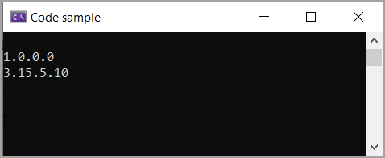

# About

For showing how to increment a `Version` using extension methods from `VersioningLibrary` class project.


```csharp
using VersioningLibrary;

namespace AutoIncrementVersion;

internal partial class Program
{
    static void Main(string[] args)
    {

        Version version = new Version(1, 0, 0, 0);


        for (int index = 0; index < 10; index++)
        {
            version = version.IncrementRevision();
        }

        version = version.IncrementBuild(5);
        version = version.IncrementMinor(15);
        version = version.IncrementMajor(2);

        Console.WriteLine(version);
        Console.ReadLine();

    }
   
}
```

Displays original value then modified value of `Version`



