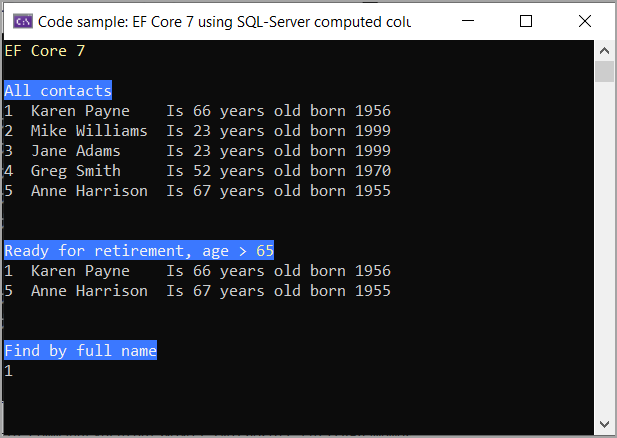

# About

This project shows how to use computed columns for SQL-Server. See the main readme file for details.



```csharp
internal partial class Program
{
    static void Main(string[] args)
    {
        Console.WriteLine();

        AllContacts();
        Console.WriteLine();

        ReadForRetirement();
        Console.WriteLine();

        FindByFullName();
        Console.WriteLine();

        AnsiConsole.MarkupLine("[white on blue]Press ENTER to exit[/]");
        Console.ReadLine();

    }

    private static void AllContacts()
    {
        using var context = new Context();
        var contacts = context.Contact.ToList();
        foreach (Contact item in contacts)
        {
            Console.WriteLine($"{item.Id,-3}{item.FullName,-15}Is {item.YearsOld,-3}years old born {item.BirthYear}");
        }

        Console.WriteLine();
    }
    private static void ReadForRetirement()
    {
        using var context = new Context();
        int yearsOld = 65;

        var readyForRetirement = context.Contact.Where(contact => contact.YearsOld > yearsOld).ToList();

        foreach (Contact item in readyForRetirement)
        {
            Console.WriteLine($"{item.Id,-3}{item.FullName,-15}Is {item.YearsOld,-3}years old born {item.BirthYear}");
        }
        
        Console.WriteLine();
    }

    private static void FindByFullName()
    {
        var fullName = "Karen Payne";
        using var context = new Context();
        var contact = context.Contact.FirstOrDefault(item => item.FullName == fullName);
        Console.WriteLine(contact.Id);
        Console.WriteLine();
    }
}
```