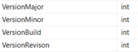
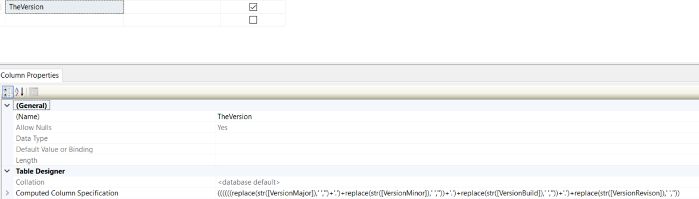
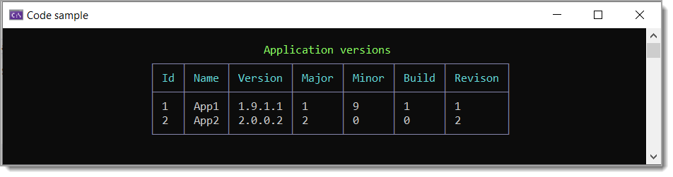

# About

This code sample shows storing version information in a SQL-Server database table.

Since each part of the version are stored as int you can take those column values and create a [Version](https://learn.microsoft.com/en-us/dotnet/api/system.version?view=net-7.0) object or use `TheVersion` column for display purposes.

---

---

