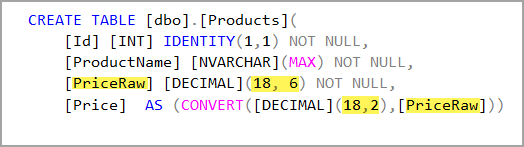
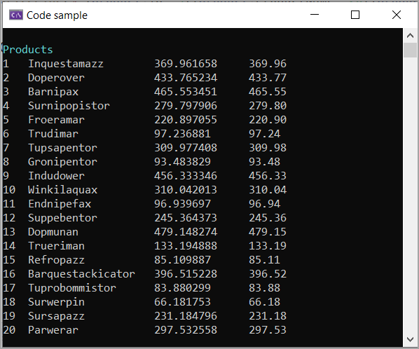

# About

This example is  how do I store an incoming decimal value with precision of 6 to precision of 2. 

- Option 1, use Math.Round
- Option 2, create a computed column as shown below.




# DbContext

Using EF Power Tools to reverse engineer the Product table shown above. HasComputedColumnSql properly configured the column Price via PriceRaw. So now if the people using the table can have the original precision and when displaying data is format to two decimal places.

```csharp
protected override void OnModelCreating(ModelBuilder modelBuilder)
{
    modelBuilder.Entity<Products>(entity =>
    {
        entity.Property(e => e.Price)
            .HasComputedColumnSql("(CONVERT([decimal](18,2),[PriceRaw]))", false)
            .HasColumnType("decimal(18, 2)");
        entity.Property(e => e.PriceRaw).HasColumnType("decimal(18, 6)");
        entity.Property(e => e.ProductName).IsRequired();
    });

    OnModelCreatingPartial(modelBuilder);
}
```

# Code to present data

```csharp
internal partial class Program
{
    static void Main(string[] args)
    {
        AnsiConsole.MarkupLine("[cyan]Products[/]");
        using (var context = new Context())
        {
            var products = context.Products.ToList();
            foreach (var product in products)
            {
                Console.WriteLine($"{product.Id,-4}{product.ProductName,-20}{product.PriceRaw,-15}{product.Price}");
            }
        }
        Console.ReadLine();
    }
}
```



