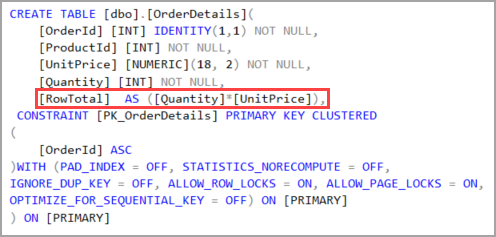

# About

In this example we are summing up `UnitPrice` <kbd>*</kbd> `Quantity` into computed column `RowTotal`


:stop_sign: run this script before running this project [Script](Scripts/Script.sql)

```csharp
public partial class OrderDetailsConfiguration : 
    IEntityTypeConfiguration<OrderDetails>
{
    public void Configure(EntityTypeBuilder<OrderDetails> entity)
    {
        entity.HasKey(e => e.OrderId);

        entity.Property(e => e.RowTotal)
            .HasComputedColumnSql("([Quantity]*[UnitPrice])", false)
            .HasColumnType("numeric(29, 2)");
        entity.Property(e => e.UnitPrice).HasColumnType("numeric(18, 2)");

        entity.HasOne(d => d.Product)
            .WithMany(p => p.OrderDetails)
            .HasForeignKey(d => d.ProductId)
            .OnDelete(DeleteBehavior.ClientSetNull)
            .HasConstraintName("FK_OrderDetails_Products");

        OnConfigurePartial(entity);
    }

    partial void OnConfigurePartial(EntityTypeBuilder<OrderDetails> entity);
}
```

---

