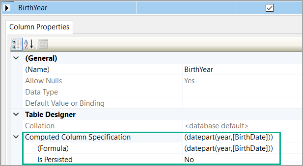
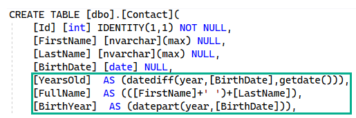
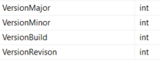
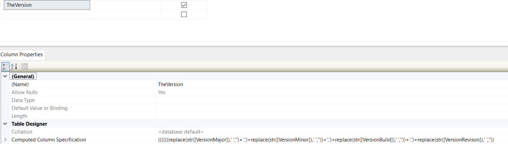
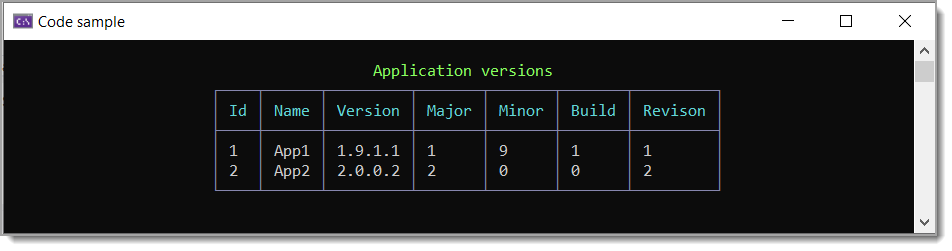
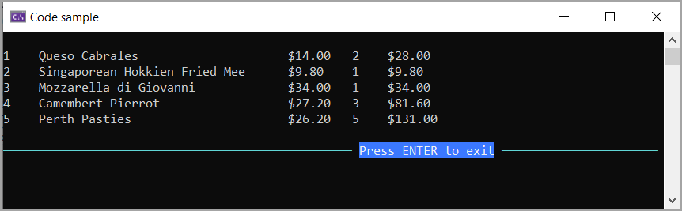

# SQL-Server: Computed columns


## What is a Computed Column?

A [Computed Column](https://learn.microsoft.com/en-us/sql/relational-databases/tables/specify-computed-columns-in-a-table?view=sql-server-ver16) is a column whose values are derived or computed by an expression. The expression might be a constant, function or combination of values from one or more columns in the same table. 

The code samples provided are based on an expressions with emphasis for [EF Core](https://learn.microsoft.com/en-us/ef/core/) while provides a data provider sample also.


Sample from code samples to get a year from the column BirthYear.



## Limitations and Restrictions

*Microsoft* [docs](https://learn.microsoft.com/en-us/sql/relational-databases/tables/specify-computed-columns-in-a-table?view=sql-server-ver16#Limitations):

- A computed column cannot be used as a DEFAULT or FOREIGN KEY constraint definition or with a NOT NULL constraint definition. However, if the computed column value is defined by a deterministic expression and the data type of the result is allowed in index columns, a computed column can be used as a key column in an index or as part of any PRIMARY KEY or UNIQUE constraint. For example, if the table has integer columns a and b, the computed column a + b may be indexed, but computed column a + DATEPART(dd, GETDATE()) cannot be indexed, because the value might change in subsequent invocations.
- A computed column cannot be the target of an INSERT or UPDATE statement.
- `SET QUOTED_IDENTIFIER` must be ON when you are creating or changing indexes on computed columns or indexed views. For more information, see [SET QUOTED_IDENTIFIER](https://learn.microsoft.com/en-us/sql/t-sql/statements/set-quoted-identifier-transact-sql?view=sql-server-ver16) (Transact-SQL).


> **Note**
> When a formula combines two expressions of different data types, the rules for data type precedence specify that the data type with the lower precedence is converted to the data type with the higher precedence. If the conversion is not a supported implicit conversion, the error **Error validating the formula for column column_name.** is returned. Use the CAST or CONVERT function to resolve the data type conflict. 

## Add a new computed column

*Microsoft* SSMS [docs](https://learn.microsoft.com/en-us/sql/relational-databases/tables/specify-computed-columns-in-a-table?view=sql-server-ver16#SSMSProcedure) using [SSMS](https://learn.microsoft.com/en-us/sql/ssms/download-sql-server-management-studio-ssms?view=sql-server-ver16) (SQL-Server Management Studio)


**Note** this can be done with EF Core also. Given the following model

```csharp
public partial class Contact
{
    public int Id { get; set; }
    public string FirstName { get; set; }
    public string LastName { get; set; }
    public DateTime? BirthDate { get; set; }
    public int? YearsOld { get; set; }
    public string FullName { get; set; }
    public int? BirthYear { get; set; }
}
```

Configuration for the model, see project [Context](EntityFrameworkCore/Data/Context.cs) `OnModelCreating`.


```csharp
protected override void OnModelCreating(ModelBuilder modelBuilder)
{
    modelBuilder.Entity<Contact>(entity =>
    {
        entity.Property(e => e.BirthDate)
            .HasColumnType("date");
        entity.Property(e => e.BirthYear)
            .HasComment("Computes birth year from BirthDate")
            .HasComputedColumnSql("(datepart(year,[BirthDate]))", false);
        entity.Property(e => e.FullName)
            .HasComputedColumnSql("(([FirstName]+' ')+[LastName])", false);
        entity.Property(e => e.YearsOld)
            .HasComment("Computes years old from BirthDate")
            .HasComputedColumnSql("(datediff(year,[BirthDate],getdate()))", false);
    });

    OnModelCreatingPartial(modelBuilder);
}
```

Here is what the raw definition looks like in SSMS.



## EF Core reading data from Contacts

First example reads all contacts while the second example asserts for contacts ready for retirement using the computed column YearsOld. Both examples display FirstName and LastName using the computed column FullName.

```csharp
private static void AllContacts()
{
    using var context = new Context();
    var contacts = context.Contact.ToList();
    foreach (Contact item in contacts)
    {
        Console.WriteLine($"{item.Id,-3}{item.FullName,-15}Is {item.YearsOld,-3}years old born {item.BirthYear}");
    }

    Console.WriteLine();
}
private static void ReadForRetirement()
{
    using var context = new Context();
    int yearsOld = 65;

    var readyForRetirement = context.Contact.Where(contact => contact.YearsOld > yearsOld).ToList();

    foreach (Contact item in readyForRetirement)
    {
        Console.WriteLine($"{item.Id,-3}{item.FullName,-15}Is {item.YearsOld,-3}years old born {item.BirthYear}");
    }
        
    Console.WriteLine();
}
```

Suppose a user interface displays `FullName`, we can use the computed column FullName to find the contact.

```csharp
private static void FindByFullName()
{
    var fullName = "Karen Payne";
    using var context = new Context();
    var contact = context.Contact.FirstOrDefault(item => item.FullName == fullName);
    Console.WriteLine(contact.Id);
    Console.WriteLine();
}
```

## EF Core working with Version class

Computed columns are very powerful. Entity Framework Core with its fluent API allows them to be easily added. Before using computed columns in production databases run test in SSMS on larger datasets than you would normally run, determine if performance is acceptable along with testing with proper indices.


This code sample shows storing version information in a SQL-Server database table.

Since each part of the version are stored as int you can take those column values and create a [Version](https://learn.microsoft.com/en-us/dotnet/api/system.version?view=net-7.0) object or use `TheVersion` column for display purposes.

Table definition








### Incrementing version parts

To keep code clean we have extension methods in a class project.

```csharp
public static class Extensions
{
    public static Version IncrementMajor(this Version sender, int increment = 1) 
        => new(sender.Major + increment, sender.Minor, sender.Build, sender.Revision);

    public static Version IncrementMinor(this Version sender, int increment = 1) 
        => new (sender.Major, sender.Minor + increment, sender.Build, sender.Revision);

    public static Version IncrementBuild(this Version sender, int increment = 1) 
        => new (sender.Major, sender.Minor, sender.Build + increment, sender.Revision);

    public static Version IncrementRevision(this Version sender, int increment = 1) 
        => new (sender.Major, sender.Minor, sender.Build, sender.Revision + increment);
}
```

Get a record

```csharp
using var context = new Context();
ApplicationSettings firstApp = context.ApplicationSettings.FirstOrDefault();
Version version = new Version(firstApp!.TheVersion);
```

Increment a part

```csharp
version = version.IncrementMajor(1);
firstApp.VersionMajor = version.Major;
```

## Simple math example

In this example we are summing up `UnitPrice` <kbd>*</kbd> `Quantity` into computed column `RowTotal`



```csharp
public partial class OrderDetailsConfiguration : 
    IEntityTypeConfiguration<OrderDetails>
{
    public void Configure(EntityTypeBuilder<OrderDetails> entity)
    {
        entity.HasKey(e => e.OrderId);

        entity.Property(e => e.RowTotal)
            .HasComputedColumnSql("([Quantity]*[UnitPrice])", false)
            .HasColumnType("numeric(29, 2)");
        entity.Property(e => e.UnitPrice).HasColumnType("numeric(18, 2)");

        entity.HasOne(d => d.Product)
            .WithMany(p => p.OrderDetails)
            .HasForeignKey(d => d.ProductId)
            .OnDelete(DeleteBehavior.ClientSetNull)
            .HasConstraintName("FK_OrderDetails_Products");

        OnConfigurePartial(entity);
    }

    partial void OnConfigurePartial(EntityTypeBuilder<OrderDetails> entity);
}
```


## See also

- EF Core [Computed columns](https://learn.microsoft.com/en-us/ef/core/modeling/generated-properties?tabs=data-annotations#computed-columns)
- [FORMAT is a convenient but expensive SQL Server function](https://www.mssqltips.com/sqlservertip/7145/sql-date-format-comparison-computed-column-materialized-column/)

# Required

Microsoft Visual Studio 2022 version 17.4 or higher

# NuGet packages

- [ConfigurationLibrary](https://www.nuget.org/packages/ConfigurationLibrary/) is used for obtaining connection strings from `appsettings` in both projects. This is a great solution when not using dependency injection.
- [Spectre.Console](https://www.nuget.org/packages/Spectre.Console/0.45.1-preview.0.47) for enhanced console writting.

## Computed Column Performance in SQL Server

In many cases, non-persistent computed columns put too much burden on the processor, resulting in slower queries and unresponsive applications. Fortunately, SQL Server provides several strategies for improving computed column performance. You can create persisted computed columns, index the computed columns, or do both.

:eyeglasses:  [Continue reading](https://www.red-gate.com/simple-talk/databases/sql-server/performance-sql-server/computed-column-performance-in-sql-server/)...

# You also might like

- [EF Core 7 code sample](https://github.com/karenpayneoregon/ef-core-7-samples)
- [SQL-Server: Exploration of datetime2(7) precision](https://github.com/karenpayneoregon/sql-server-datetime2)
- [EF Core: Working with TimeOnly](https://github.com/karenpayneoregon/ef-core-dateonly-timeonly)
- [Storing passwords in SQL-Server database](https://dev.to/karenpayneoregon/passwords-in-sql-server-c-1fhf)
- [Learn DateOnly & TimeOnly](https://dev.to/karenpayneoregon/learn-dateonly-timeonly-23j0)

# Summary

This repository contents provide working code samples focused on using computed columns with EF Core and for those using a data provider [System.Data.SqlClient](https://www.nuget.org/packages/System.Data.SqlClient) for instance computed columns work too.

:small_blue_diamond: Not all possiblities are presented, code sample have been kept simple for the sake of easy learning.